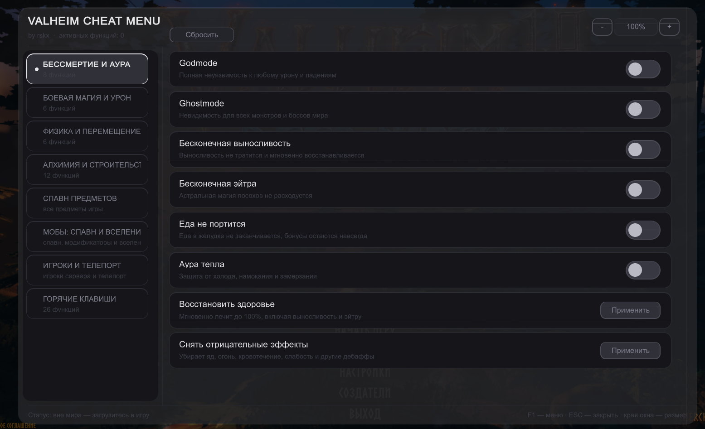

# Valheim Cheat Menu — BepInEx-плагин — by rskx

Чит меню для *одиночной игры / своего сервера*.

## Установить BepInEx

1. Скачай *BepInEx 5.4.23.2 x64* — с github сайта: https://github.com/BepInEx/BepInEx/releases?after=v5.4.4
2. Распакуй архив в корень игры.
3. Запусти игру один раз, чтобы BepInEx создал папки и `LogOutput.log`.

## Запуск

1. Запусти *Valheim*.
2. Чтобы открыть чит меню нажми F1 (Так же чит открывается и в лобби игры).

## Скриншот
